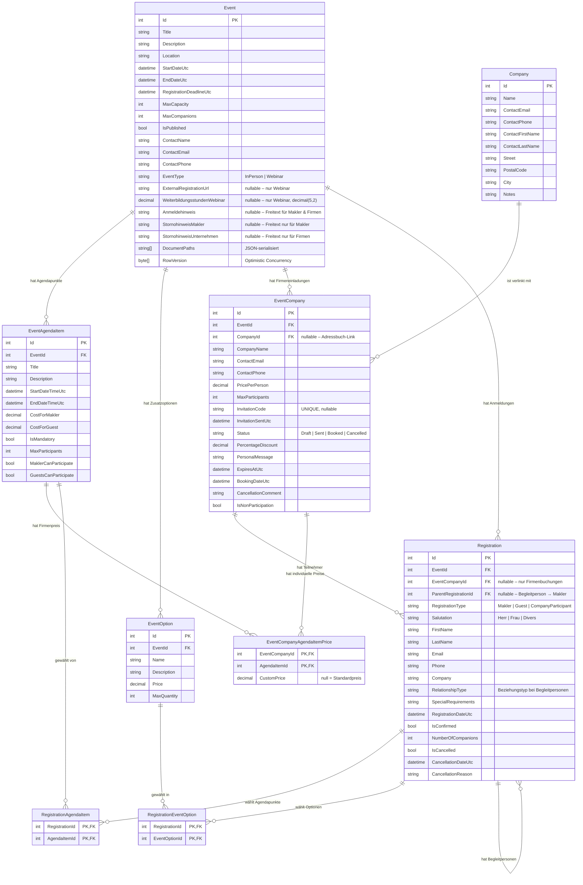

# Domainmodell — EventCenter

Stand: 2026-03-03 (aktualisiert 2026-03-03 — Hinweis-Felder, WeiterbildungsstundenWebinar)

## Entity-Relationship-Diagramm

---

## Enumerationen

| Enum | Werte |
|---|---|
| `EventType` | `InPerson`, `Webinar` |
| `EventState` | `NotPublished`, `Public`, `DeadlineReached`, `Finished` _(berechnet, nicht persistiert)_ |
| `RegistrationType` | `Makler`, `Guest`, `CompanyParticipant` |
| `InvitationStatus` | `Draft`, `Sent`, `Booked`, `Cancelled` |

---

## Cascade-Delete-Verhalten

| Beziehung | Verhalten |
|---|---|
| Event → EventAgendaItem | Cascade |
| Event → EventCompany | Cascade |
| Event → Registration | Cascade |
| Event → EventOption | Cascade |
| EventCompany → EventCompanyAgendaItemPrice | Cascade |
| EventCompany → Registration | Restrict _(Buchungen schützen)_ |
| EventAgendaItem → EventCompanyAgendaItemPrice | NoAction _(kein Cascade-Zyklus)_ |
| EventAgendaItem → RegistrationAgendaItem | NoAction _(kein Cascade-Zyklus)_ |
| Registration → RegistrationAgendaItem | Cascade |
| Registration → Registration (Begleitperson) | Restrict _(Begleitpersonen schützen)_ |

---

## Schlüsselbeziehungen in Prosa

### Veranstaltung (`Event`)
Zentrale Entität. Hat Agendapunkte, Zusatzoptionen, Firmeneinladungen und direkte Makler-Anmeldungen. `EventType` unterscheidet Präsenzveranstaltungen von Webinaren. Webinar-spezifische Felder (`ExternalRegistrationUrl`, `WeiterbildungsstundenWebinar`) sind nullable und werden nur bei `EventType = Webinar` befüllt. Die drei Hinweisfelder (`Anmeldehinweis`, `StornohinweisMakler`, `StornohinweisUnternehmen`) sind für beide Veranstaltungstypen optional und werden rollenspezifisch angezeigt.

### Firmeneinladung (`EventCompany`)
Verbindet eine Veranstaltung mit einem Unternehmen. Enthält den gesamten Einladungslebenszyklus (`Draft → Sent → Booked / Cancelled`). Der nullable `CompanyId`-FK verknüpft optional mit dem Firmenstammdaten-Adressbuch (`Company`). Individuelle Preise pro Agendapunkt werden in `EventCompanyAgendaItemPrice` gespeichert.

### Anmeldung (`Registration`)
Wird sowohl für Makler-Direktanmeldungen (`EventCompanyId = null`) als auch für Firmenbuchungsteilnehmer (`EventCompanyId = X`) verwendet. Begleitpersonen (`RegistrationType = Guest`) referenzieren über `ParentRegistrationId` die Hauptanmeldung des Maklers. Die M:N-Beziehungen zu Agendapunkten und Optionen werden über `RegistrationAgendaItem` und `RegistrationEventOption` (Junction-Tabellen) abgebildet.

### Firmenstammdaten (`Company`)
Adressbuch-Entität. Wird beim Erstellen einer Firmeneinladung optional verknüpft. Die Verknüpfung ist nullable für Rückwärtskompatibilität mit manuell eingetragenen Firmen.

---

## Externe API-DTOs (nicht persistiert)

### `GuestooEventDto` / `GuestooEventLocation`
Read-only-Records für die Antwort der Guestoo-Event-API. Werden in `GuestooEventApiService` deserialisiert und **nicht** in der Datenbank gespeichert.

| Typ | Property | Typ | Beschreibung |
|---|---|---|---|
| `GuestooEventDto` | `Title` | `string?` | Veranstaltungstitel |
| | `Subtitle` | `string?` | Untertitel |
| | `Location` | `GuestooEventLocation?` | Verschachtelte Ortsangabe |
| | `StartDate` | `DateTimeOffset?` | Startzeit mit Zeitzone |
| | `EndDate` | `DateTimeOffset?` | Endzeit mit Zeitzone |
| | `AvailableSeats` | `long?` | Verfügbare Plätze |
| | `ImageUrl` | `string?` | Bild-URL |
| | `ShortDescription` | `string?` | Kurzbeschreibung |
| | `EventLink` | `string?` | Direktlink zur Veranstaltung |
| `GuestooEventLocation` | `Street` | `string?` | Straße |
| | `StreetNumber` | `string?` | Hausnummer |
| | `PostCode` | `string?` | PLZ |
| | `City` | `string?` | Stadt |
| | `Country` | `string?` | Land |

---

## Formularmodelle (nicht persistiert)

### `CompanyBookingFormModel` / `ParticipantModel`
View-Models für das Firmenbuchungsformular (`CompanyBooking.razor`).

| Typ | Property | Typ | Beschreibung |
|---|---|---|---|
| `CompanyBookingFormModel` | `EventCompanyId` | `int` | Referenz auf die Firmeneinladung |
| | `Participants` | `List<ParticipantModel>` | Teilnehmerliste (mind. 1 Eintrag) |
| | `SelectedExtraOptionIds` | `List<int>` | Ausgewählte Zusatzoptionen |
| `ParticipantModel` | `Salutation` | `string` | Anrede |
| | `FirstName` | `string` | Vorname |
| | `LastName` | `string` | Nachname |
| | `Email` | `string` | E-Mail |
| | `SelectedAgendaItemIds` | `List<int>` | Ausgewählte Agendapunkte |
| | `AgendaRequired` | `bool` | Berechnetes Flag: `true` wenn die Veranstaltung wählbare Agendapunkte hat → Pflichtauswahl im Formular |
