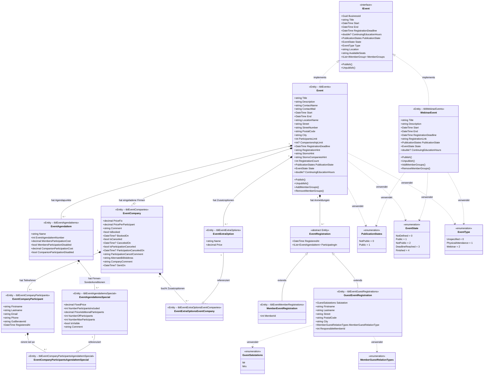

# Veranstaltungscenter – Domainmodell

## Klassendiagramm

## Beschreibung der Entitäten

### Kern-Entitäten

| Entität | Tabelle | Beschreibung |
|---|---|---|
| `IEvent` | – | Interface für alle Veranstaltungstypen |
| `Event` | `tblEvents` | Physische Präsenzveranstaltung mit Ort, Teilnehmerlimits und Begleitpersonenlimit |
| `WebinarEvent` | `tblWebinarEvents` | Online-Webinar (z. B. GoToWebinar) mit externem Registrierungslink |

### Agenda & Optionen

| Entität | Tabelle | Beschreibung |
|---|---|---|
| `EventAgendaItem` | `tblEventAgendaItems` | Einzelner Programmpunkt einer Veranstaltung mit Teilnahmekosten |
| `EventAgendaItemsSpecial` | `tblEventAgendaItemsSpecial` | Firmenseitige Sonderkonditionen für einen Agendapunkt (Fixpreis, inkludierte Teilnehmer) |
| `EventExtraOption` | `tblEventExtraOptions` | Buchbare Zusatzoption zu einer Veranstaltung (z. B. Unterkunft) |

### Firmenanmeldung

| Entität | Tabelle | Beschreibung |
|---|---|---|
| `EventCompany` | `tblEventCompanies` | Einladung einer Firma zu einer Veranstaltung inkl. Preis und Status |
| `EventCompanyParticipant` | `tblEventCompanyParticipants` | Einzelner Teilnehmer einer eingeladenen Firma |
| `EventExtraOptionsEventCompany` | `tblEventExtraOptionsEventCompanies` | Verknüpfung: Firma bucht Zusatzoption |
| `EventCompanyParticipantsAgendaItemSpecial` | `tblEventCompanyParticipantsAgendaItemSpecial` | Verknüpfung: Teilnehmer nimmt an Sonder-Agendapunkt teil |

### Mitglieder- und Gastanmeldung

| Entität | Tabelle | Beschreibung |
|---|---|---|
| `EventRegistration` | – | Abstrakte Basisklasse für alle Anmeldungen |
| `MemberEventRegistration` | `tblEventMemberRegistrations` | Anmeldung eines Maklerportal-Mitglieds |
| `GuestEventRegistration` | `tblEventGuestRegistrations` | Anmeldung einer Begleitperson (durch ein Mitglied verwaltet) |

### Enumerationen

| Enum | Werte | Verwendung |
|---|---|---|
| `PublicationStates` | `NotPublic`, `Public` | Veröffentlichungsstatus einer Veranstaltung |
| `EventState` | `NotDefined`, `Public`, `NotPublic`, `DeadlineReached`, `Finished` | Berechneter Zustand (aus Status + Datum) |
| `EventType` | `Unspecified`, `PhysicalAttendance`, `Webinar` | Art der Veranstaltung |
| `GuestSalutations` | `Mr`, `Mrs` | Anrede für Gastanmeldungen |
| `MemberGuestRelationTypes` | – | Beziehungstyp Mitglied–Gast |
